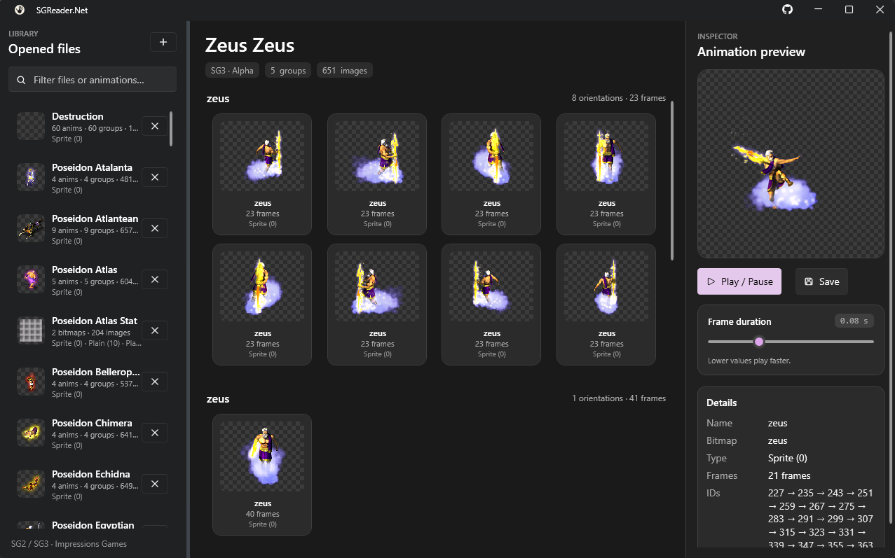

<p align="center">
  
</p>

# SGReader.Net

Extract sprites from the Impressions Games city-building titles (Caesar III, Pharaoh, Zeus, Emperor, etc.), inspired by [Pecunia SGReader](https://github.com/bvschaik/citybuilding-tools).



## Requirements

- [.NET 10 SDK](https://dotnet.microsoft.com/download)
- Windows (WPF + `System.Drawing`)

UI stack: [WPF-UI](https://github.com/lepoco/wpfui) + CommunityToolkit.Mvvm.

## Build

```bash
dotnet build src/SGReader.sln -c Release
```

## Publish (single .exe)

**Visual Studio**

1. Right-click the `SGReader` project → **Publish…**
2. Select the **FolderProfile** (Folder) profile
3. **Publish**

Output: `publish/SGReader.Net-1.0.0.exe`

**CLI**

```bash
dotnet publish src/SGReader/SGReader.csproj -c Release -o publish -p:PublishSingleFile=true -p:SelfContained=false
```

Framework-dependent win-x64 (~7 MB). Requires [.NET 10 Desktop Runtime](https://dotnet.microsoft.com/download/dotnet/10.0).

Bump `<Version>` in `src/SGReader/SGReader.csproj` to change the exe name (`SGReader.Net-<version>.exe`).

## UI

```bash
dotnet run --project src/SGReader -c Release
```

Open `.sg2` / `.sg3` files (keep matching `.555` files next to them, or in a `555/` subfolder).

## CLI

```bash
# List file info
dotnet run --project src/SGReader.CLI -c Release -- path\to\file.sg3 --list

# Extract all sprites to PNGs
dotnet run --project src/SGReader.CLI -c Release -- path\to\file.sg3 -o path\to\output
```

Default output directory is `./<sg-name>/`, with one subfolder per bitmap.
